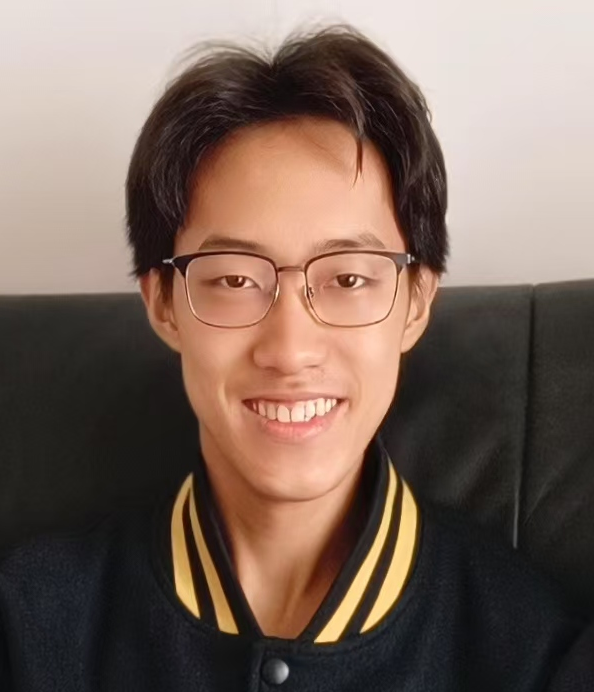

<table width="100%">
  <tr>
     <td>
      
    </td>
    <td align="fload:left">
      <h1>Yiheng Ge(葛毅恒)</h1>
      <b>Shanghai Jiao Tong University</b> 
      <b>School of Computer Science and Engineering</b> 
       
      <b>Major:</b> Software Engineering 
      <b>Enrollment Year:</b> 2023 
      <b>Email:</b> geyiheng@sjtu.edu.cn 
    </td>
 
  </tr>
</table>

## Research

**[NeurIPS 2025]** *Under Review*  
**RoboTwin 2.0: Autonomous Data Generator and Benchmark with Strong Domain Randomization for Robust Bimanual Robotic Manipulation**

*Tianxing Chen, Zanxin Chen, Baijun Chen, Qiwei Liang, Zixuan Li, XianLiang Lin, **Yiheng Ge**, Zijian Cai, Zhenyu Gu, Weiliang Deng, Yibin Liu, Yubin Guo, Xuanbing Xie, Qiangyu Chen, Kailun Su, Tianling Xu, Guodong Liu, Mengkang Hu, Tian Nian, Huan-ang Gao, Yusen Qin, Kaixuan Wang, Zhixuan Liang, Xiaokang Yang, Ping Luo, Yao Mu*

## Internship

### Emagen AI
- Algorithm Engineer
- Developed NoteAgent, an agentic system that manages user's filesystem, with semantic tree auto-construction that speeds up querying while being memory efficient.

## Competitions

### 1. Huawei ICT Competition
- **Team Leader**
- HomeAgentMaster based on handcrafted Hexapod Robot and OrangePi AI Pro
- **First Prize in China Final** and **Second Prize in Global Final**

### 2. OpenHarmony Competition 2024
- **Sole Member**
-  Smart phone Operating Agent based on OpenHarmony DAYU 200, supporting routing three different types of mainstream operating methods to accomplish long-range UI operating tasks
- **Special Innovation Award** (the only one among 83 teams with 220 students)

### 3. China International Aircraft Design Challenge
- Member of Avionics Team
-  Developed C++ code based on ROS and MAVROS on NVIDIA Jetson NX and won the **Second Prize**

### 4. National College Student Software Innovation Competition
- **Sole Member**
-  Workflow construction platform supporting multimodal input/output and task generalization & memory module for smartphone operating tasks
and won the **Third Prize**

### 5. National Mathematical Modeling Competition 2024
- Learned and applied various Python NLP optimization algorithms and visualization methods
- Collaborated with team members to complete the paper "Research on Dynamic Behavior and Path Optimization of Coiling Dragons Based on Archimedean Spiral and Optimization Algorithms" and won Provincial **Third Prize**

## Clubs & Classes

I have been a member of:
1. **SJTU 2nd AIGC Class**
2. **SJTU Aero Sports Club** - Avionics Team
3. **SJTU Robocup Club** - Software Team
